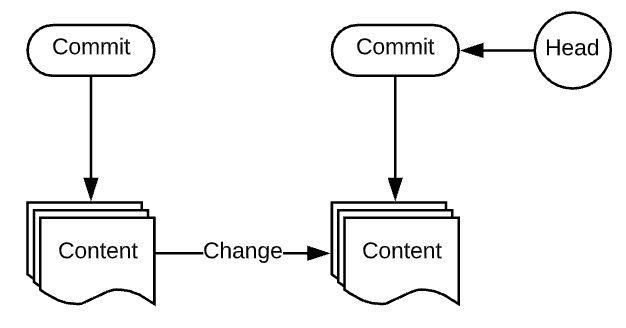

## Background 

* ``git`` was created by Linus Torvalds, the creator of Linux
* In short, ``git`` manages changes in files and is one of the leading tools for source control. 
* Some basic terminology 
  * ``commit`` defines the state of files as they were at that point in time
  * ``commit``s are affiliated with repositories and branches 
  * A current ``commit`` is called a ``head``

## Installation 

### Linux 
 * ``$ sudo yum install -y git``
 * ``$ sudo apt-get install -y git``

### MacBook
* Homebrew: ``$ brew install git``
 > If you do not have homebrew installed, run:
 ``/bin/bash -c "$(curl -fsSL https://raw.githubusercontent.com/Homebrew/install/HEAD/install.sh)"``

 ### Windows 
 * Download [git](https://git-scm.com/download/win)
 * Use [Chocolatey](https://chocolatey.org/packages/git)

### Create repository and initial configuration 
* ``$ mkdir [repo-name]``
* ``$ cd [repo-name]``
* ``$ git init`` initialize repository 
 > ``init`` will create a .git directory in the repository

OUTPUT: ``Initialized empty Git repository in /Users/name/path/to/folder/.git/``

* Set global username ``git config --global user.name [username]``
* Set global email ``git config --global user.email [email_addr]``

### Working with git

* Check status: ``$ git status``
* Adding files: ``$ git add -A`` flag will add all pending files 
* Add one file: ``$ git add [file name]``
* Commit files: ``$ git commit -m "message"``
* Stop tracking a file: ``$ git rm [file]``
* Push to master: ``$ git push origin master``

### Set origin and upstream github repo
* Set origin: ``$ git remote add origin https://github.com/user/repo.git``
* Set upstream: ``$ git remote add upstream https://github.com/ORIGINAL_OWNER/ORIGINAL_REPOSITORY.git``

### Cloning and branching 
* Clone repo locally: ``$ git clone [path-to-github-repo.git]``
* Create a branch: ``$ git branch [branch-name]``
* Start working in a branch: ``$ git checkout [branch-name]``
 > Do both: `` $ git checkout -b [branch-name]``

## Checking files
NOTE:``q`` to quit view 
* Check file difference: ``$ git diff ``
* Check log: ``$ git log`` 

### Merging and pushing 
* Merge a branch: ``$ git merge [branch-name]``
* Push to master: ``$ git push origin master``

### Use case pattern 
* you changed and/or added files in a repo and you want these files to be grouped into a branch prior to merging with master 
1. checkout a branch: ``$ git checkout -b [branch-name]``
2. check status: ``$ git status``
3. check diff: ``$ git diff``
4. add files: ``$ git add -A``
5. commit changes: ``$ git commit -m "message"``
6. checkout master: ``$ git checkout master``
7. merge changes: ``$ git merge [branch-name]``
8. push to github/lab: ``$git push origin master``
